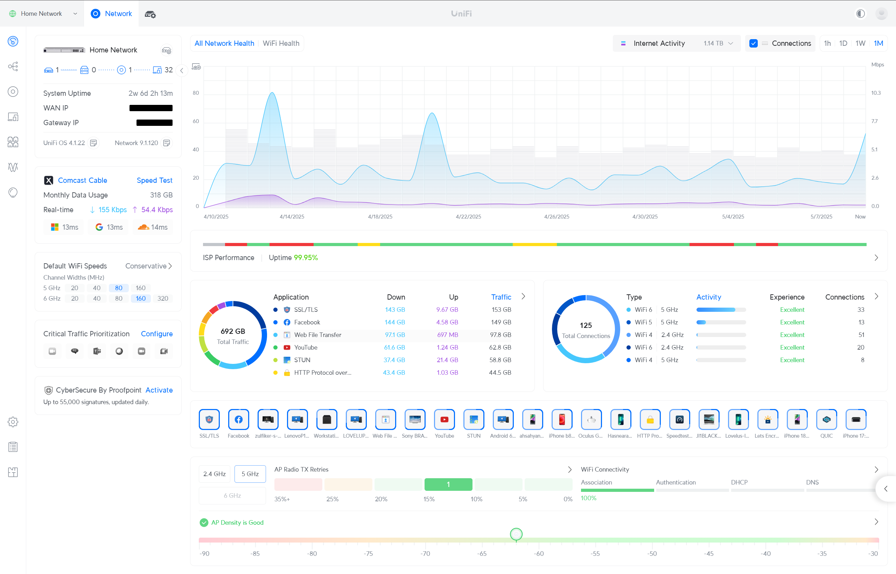
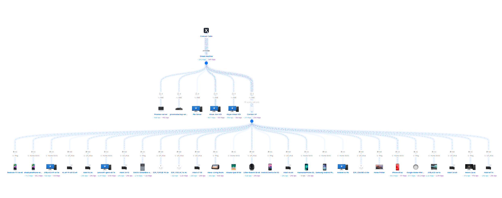
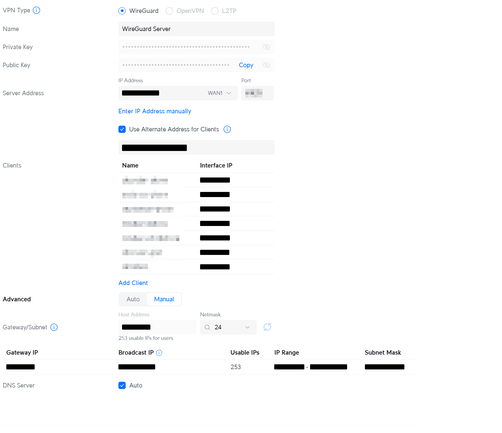
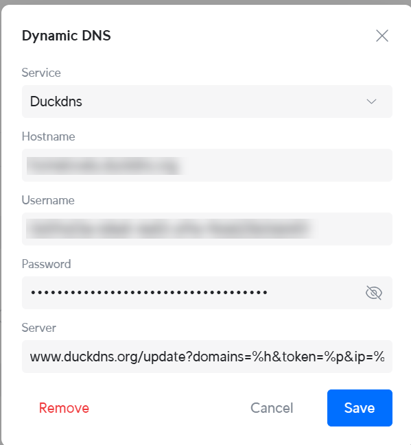
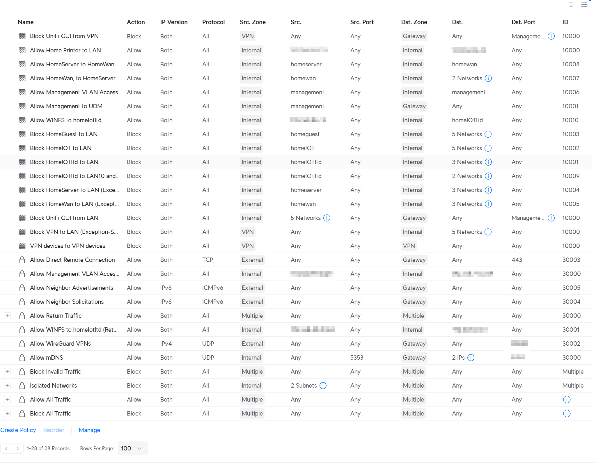
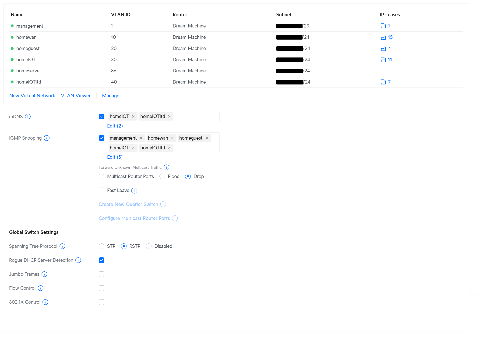
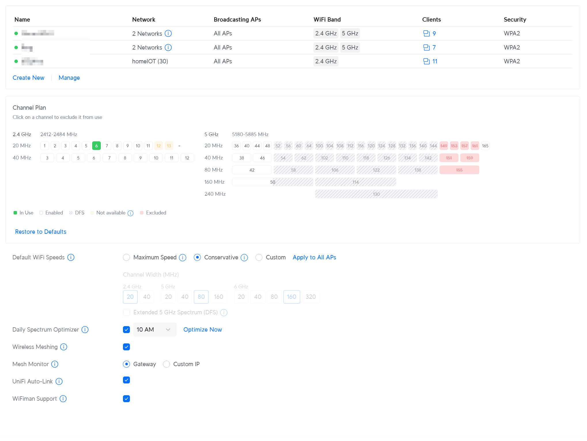
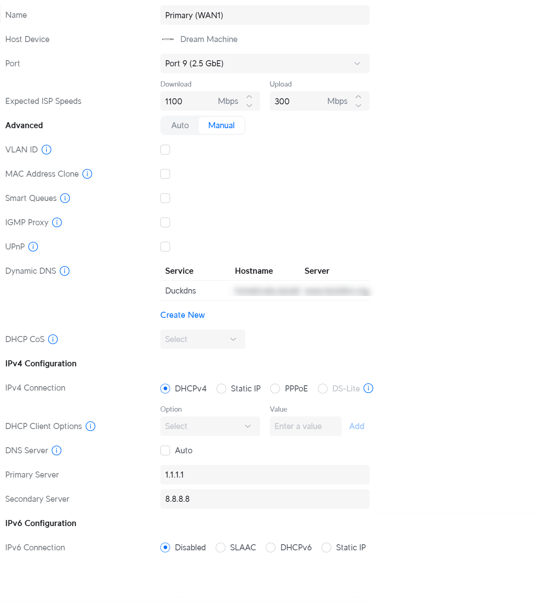

# 🏠 UniFi Network Lab

Welcome to my home lab project — a fully segmented, monitored, and secure network built using the **UDM Pro SE (UniFi OS 4.1.22)**. This setup simulates enterprise-grade architecture for learning, documentation, and real-world practice.

---

## 📊 Dashboard Overview



---

## 🌟 Project Goals

- 🧱 Learn and apply real-world VLAN segmentation
- 🔐 Secure access using WireGuard + DDNS
- 📊 Monitor network and server activity with Grafana + InfluxDB
- 📆 Back up and restore with Proxmox Backup Server
- 🧰 Document infrastructure like a real system admin

---

## 📂 Repository Structure

```
unifi-network-lab/
├── README.md
├── /configs/
│   ├── firewall_rules.md
│   ├── vpn_config.md
│   ├── ddns_config.md
│   ├── network_vlan_config.md
│   ├── wifi_config.md
│   └── internet_wan_config.md
├── /automation/
│   └── wireguard_ddns_sop.md
├── /monitoring/ (In Progress)
│   ├── unifi_poller_setup.md
│   ├── influxdb_setup.md
│   └── grafana_dashboards.json
├── /backup_and_restore/
│   ├── proxmox_pbs_guide.md
│   └── restore_from_crash.md
├── /screenshots/
└── LICENSE
```

---

## 🌐 Core Config Files

| Area                | Doc Link                                             |
|---------------------|------------------------------------------------------|
| Firewall Rules      | [firewall_rules.md](configs/firewall_rules.md)       |
| VPN Configuration   | [vpn_config.md](configs/vpn_config.md)               |
| DDNS Setup          | [ddns_config.md](configs/ddns_config.md)             |
| Network & VLAN Info | [network_vlan_config.md](configs/network_vlan_config.md) |
| WiFi Settings       | [wifi_config.md](configs/wifi_config.md)             |
| WAN/Internet Config | [internet_wan_config.md](configs/internet_wan_config.md) |

---

## 📸 Topology & Screenshots

| Type                   | Preview                                  |
|------------------------|------------------------------------------|
| Full Network Topology |     |
| WireGuard Server Config |  |
| DDNS Settings (DuckDNS) |  |
| Firewall Rules Overview |      |
| VLAN & Network Table    |        |
| WiFi Configurations     |              |
| WAN Internet Config     |      |

---

## ✍️ Author

**Allfin Ahsan**  
System Administrator & Cybersecurity Learner  
Documenting my infrastructure one repo at a time 🛠️

---
